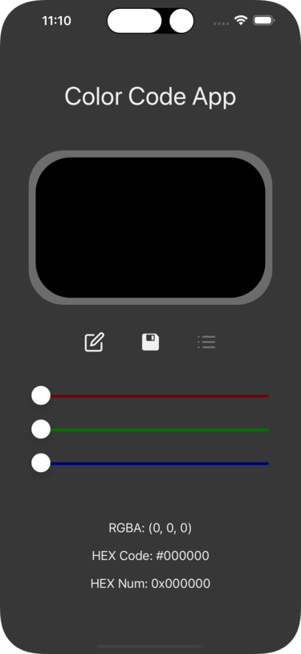
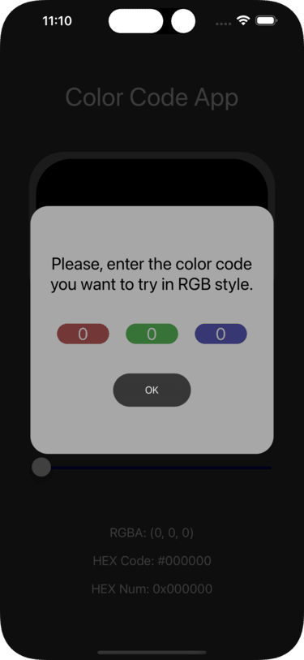
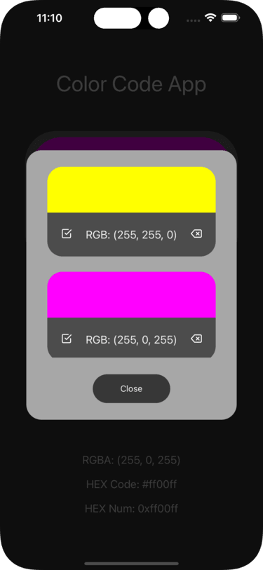

# Color Picker App

**Hello!**

Welcome to my first personal project in _React Native_.

I have made a similar concept when I studied HTML, CSS and JavaScript for the first time. And now, I wanted to resurrect the concept with more experience under my belt.

I've been studying React Native for about two months now. Since I have studied a little bit of Flutter and I have two years experience with React.js, I thought the best way to complete this project without delay or complications, and without me getting tired of it and abandoning it, would be React Native.

This Application has three main parts: The **_Home Screen_**, the **_RGB Code Input_** and the **_Saved Colors List_**.

## Home Screen

This is the first screen you will see when opening the app.

As you can see, you have a black screen in the middle. This will update as you move the sliders down below.

Next, you will notice three buttons. They serve three purposes. The first allows you to input a color by its RGB code. The second will save the color that is currently displayed into the local storage. The last one will display a list of the saved colors and provide the posibility to select them from there.

After that, you will have three sliders corresponding to RGB ( red, green and blue ), and three numeric codes, corresponding to the RGB code, hexadecimal code ( mostly used in CSS ) and hexadecimal integer, which I observed being used in Flutter.

## RGB Code Input

Pressing the input color button will open this modal in which the default values are the ones you have into its corresponding slider.

You have a background color that will indicate which slider you will be modifying and will only allow you to enter values between 0 and 255.

Once you click the _OK_ button, the changes will affect the **_color preview screen_**.

## List of Saved Colors

If you pay atention to the _Save Color_ button one the _Home screen_, you will notice that once a color is saved, the button turns gray and does not react to any interaction. That's beacause you can't save the same color more than once.

So what happens when a color is _saved_ ?

That's where a once native library of React Native comes into play. The **_AsyncStorage_** package allows you to work with a local storage of the phone. In this case, it will save all the colors we want and allow us to use them again in the future.

Every saved color will be displayed in this list. And two new buttons will also be shown. The left button will let you apply the saved color to the **_color preview screen_**, and the right button will delete that saved color from the list.

